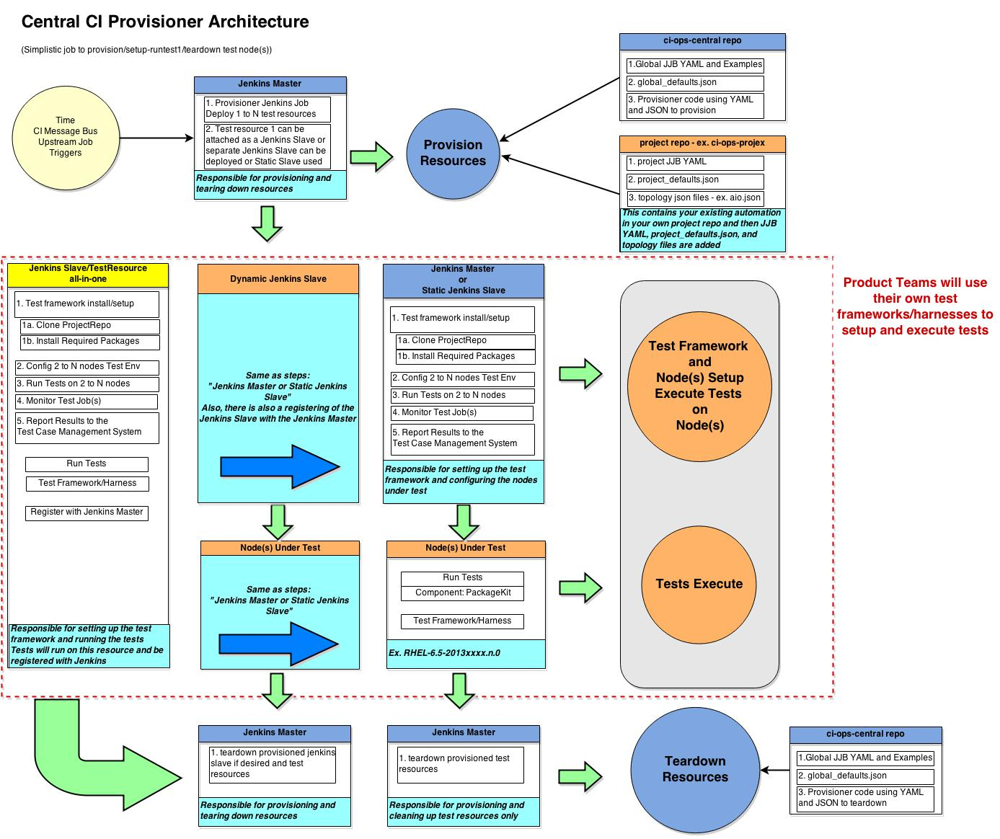
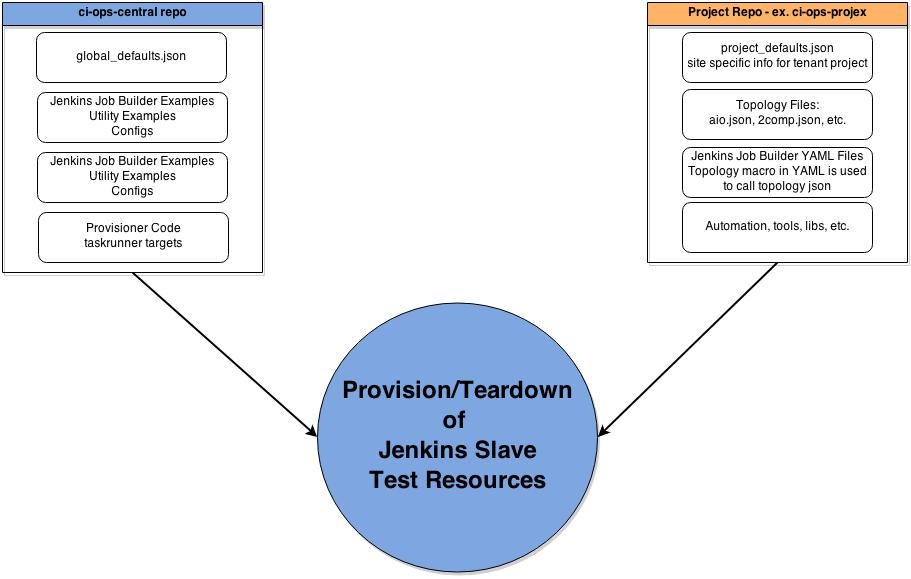

Overview
********

CI Central is an overall set of tools to help with the continuous integration process.
This is to be used as a core foundation for all Red Hat Products and Technologies teams to use to help provision, run tests, and teardown resources continuously.
You can provision VMs in an Openstack environment and baremetal resources in Beaker or Foreman.
This project will also handle tasks to run in parallel, quota management, queuing, and cloud bursting.
It leverages some Python integration scripts, Jenkins, and Jenkins Job Builder.

Architecture
============

Integration View
----------------

Provision and Teardown View
---------------------------

Glossary of terms
-----------------

* ci-ops-central - A repo that contains all the core of the code that handles provisioning and tearing down resources
* ci-ops-projex - This is an example repo much like your own project repo that contains your own automation.
                  It shows examples of the key files you MUST have in your own repo. project_defaults.json, topology files - aio.json, 2comp.json, JJB YAML files
* Project/Tenant - A grouping of resources in the infrastructure such as openstack, beaker, or foreman
                   This is defined in the project_defaults.json
* Topology - A file that describes a set of resources that will get provisioned.
             In the case of openstack this would be flavor and image and in Beaker this would be distro and arch
* JJB (Jenkins Job Builder) - These are YAML files that populate a Jenkins Master with jobs
* Jenkins Master - The core of where all jobs are run from and contains certain plugins to help drive provisioning and testing
* Jenkins Slave - A system that is registered with the Jenkins Master to be used as a resource to run jobs on instead of using the Jenkins Master resources
* aio - all-in-one system to be a test resource and execute tests
* metadata - In ci-provisioner terms you can add this in your topology files and define any variables you want to be available once your resources have been provisioned
* ansible - Section to indicate the execution of ansible playbooks

 - playbooks - Array of playbooks to execute
 - name - Name of ansible execution - default = "Provisioner and Ansible execution"
 - users - Users that are on the system - default = "root,test"
 - remote_user - User to run ansible playbook as - default = "root"
 - hostsfile - Ansible hosts file - default = "$WORKSPACE/hosts-<UUID>"
 - ssh_keyfile - SSH private key to talk to remote machine - default = "ci-ops-central/targets/keys/ci-ops-central"
 - pattern - Pattern of machines to execute ansible against - default = "testsystems"
 - useips - Use IPs in HOSTSFILE instead of names
 - runlocal - Run it locally from current machine

* repos - Add yum repos to jenkins slaves and test resources

 - name - name of repository
 - baseurl - If used then can't use mirrorlist
 - mirrorlist - If used then baseurl can't be used
 - skip_if_unavailable - Set to 0 by default
 - gpgcheck - Set to 0 by default
 - enabled -  Set to 1 by default

* packages

 - yum - String of yum packages
 - pip - String of pip packages

* OPENSTACK Specific

 - flavor - This is an Openstack concept and means the size of VM. These flavors define Memory, VCPUs, and Disk Size. Usually m1.tiny, m1.small, m1.medium, m1.large, m1.xlarge
 - image - This is an Openstack term used to reference an image name

* BEAKER Specific Note this is not limited to these and the provisioner can use any keyword in a recipeset that is used in Beaker

 - recipesets - List of the below to specify different combinations of distro, family, variant, etc.
 - distro - Specify a distro name ex. RHEL-6.5
 - family - Specify a family of distributions ex. Red Hat Enterprise Linux 6
 - tag - Specify a tag with family ex. RTT
 - variant - Specify a variant ex. Server
 - arches - Specify system architectures ex. "arches": ["X86_64"]
 - hostrequire - Specify host requirements ex. "hostrequire": ["arch=X86_64"]
 - keyvalue - Specify key/value defined on a host ex. "keyvalue": ["MEMORY>1000", "DISKSPACE>20000"]
 - taskparam - Specify a parameter to the install or reserve task
 - bkr_data - Used to pass specific identifier to determine which machine is which

* Foreman Specific - Foreman is an open source project that gives system administrators the power to easily automate repetitive tasks, quickly deploy applications, and proactively manage servers, on-premises or in the cloud. We are using it primarily for Bare Metal provisioning

 - hostnames - Specify a list of hostnames that are in foreman
 - hostgroup - Select hosts from a hostgroup
 - prefix - Select hosts that begin with a certain prefix
            *Note - Hostgroup and prefix can be used together.*
